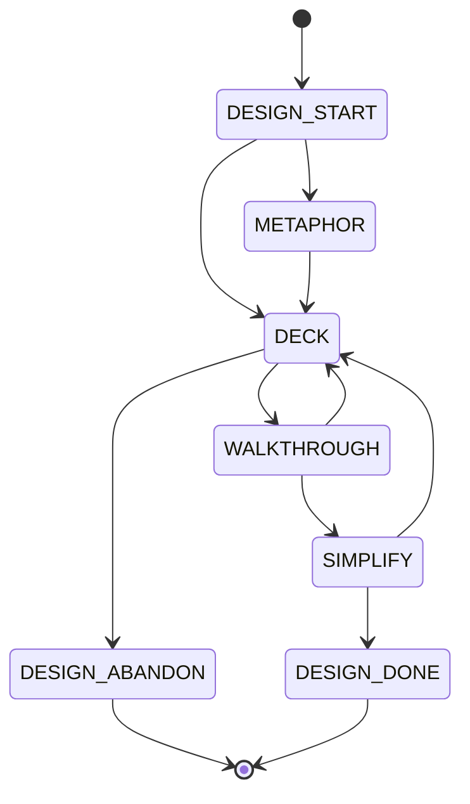

# draft-claude-xp-design-00: Metaphor, CRC Decks, and Simple Design

**Status:** DRAFT
**Category:** Experimental
**Authors:** Claude (drafting agent), Norman Nunley, Jr <nnunley@gmail.com>
**Date:** 2026-08-19

## Abstract

This document specifies the design session delegated from
draft-claude-xp-pairing-00's `DESIGN` stage: choosing a system metaphor,
laying out a CRC deck, walking a scenario through it card by card, and
simplifying before any test is written. The deck is a checked artifact
rather than a discussion: card names are unique, collaborators must resolve,
every card must be reachable from a declared root, and a card carrying more
than three responsibilities is rejected — restoring mechanically the
constraint the physical index card used to impose. A metaphor whose terms
are not card names is rejected as decorative.

## Motivation

Design is the XP practice that degrades most quietly in an agent pair. Asked
to design before implementing, an agent produces a paragraph of plausible
architecture, agrees it is simple, and writes the code it was going to write
anyway. Nothing in that exchange is checkable, and nothing in it survives to
the next session — the "design" was a conversational gesture, and the real
design is whatever the code turned out to be.

XP's own design practices were physical, and the physics did the enforcing.
A CRC card is an index card: three responsibilities is roughly what fits, so
a class doing eight things cannot be written down, and the failure to write
it down is the design feedback. Cards on a table are walked through by hand
for a scenario, so a missing collaborator shows up as a card someone reaches
for and cannot find. A metaphor is shared out loud, so a metaphor nobody
uses dies immediately instead of persisting in a document.

Delete the table and the cards and none of that feedback happens. This
document puts the constraints back as a deck format with a checker: the
responsibility budget is a rule, the missing collaborator is a dangling
reference, the unused card is unreachable, and the decorative metaphor is a
term that names no card. What was enforced by cardboard is now enforced by
exit code.

## Terminology

The key words "MUST", "MUST NOT", "REQUIRED", "SHALL", "SHALL NOT", "SHOULD",
"SHOULD NOT", "RECOMMENDED", "NOT RECOMMENDED", "MAY", and "OPTIONAL" in this
document are to be interpreted as described in BCP 14 (RFC 2119, RFC 8174)
when, and only when, they appear in all capitals, as shown here.

- **deck** — the system's set of CRC cards, in the format this document
  specifies. One deck per system, extended by each design session.
- **card** — one design element: a name, its responsibilities, and its
  collaborators.
- **responsibility** — something the card knows or does, in the problem's
  language. A card carries at most three.
- **collaborator** — another card, or a declared external, that this card
  needs to meet a responsibility.
- **root** — a card a scenario enters the deck through. Reachability is
  measured from roots.
- **metaphor** — the system's governing analogy, plus the **terms** it
  contributes. Terms MUST be card names.
- **walkthrough** — driving one concrete scenario through the deck, card by
  card, naming which card handles each step.
- **simplest** — the four rules of simple design, in order: the design runs
  the tests, reveals its intention, contains no duplication, and has the
  fewest elements consistent with the first three.

## Specification

### The design session is a machine

A design session MUST walk this machine, and the parent session MUST NOT
attach `deck:` to `DESIGN` until it reaches `DESIGN_DONE`. A session
reaching `DESIGN_ABANDON` returns to the parent with a spike question, not a
design. [R-xp-design-machine]

```fsm @R-xp-design-machine
initial DESIGN_START
DESIGN_START -> METAPHOR
DESIGN_START -> DECK
METAPHOR -> DECK
DECK -> WALKTHROUGH
DECK -> DESIGN_ABANDON
WALKTHROUGH -> DECK
WALKTHROUGH -> SIMPLIFY
SIMPLIFY -> DECK
SIMPLIFY -> DESIGN_DONE
terminal DESIGN_DONE DESIGN_ABANDON
guard DESIGN_START -> METAPHOR: question
guard DESIGN_START -> DECK: metaphor
guard METAPHOR -> DECK: metaphor
guard DECK -> WALKTHROUGH: deck
guard DECK -> DESIGN_ABANDON: blocked
guard WALKTHROUGH -> DECK: gap
guard WALKTHROUGH -> SIMPLIFY: scenario
guard SIMPLIFY -> DECK: revision
guard SIMPLIFY -> DESIGN_DONE: simplest
note DESIGN_START: design only what THIS story needs; if the system already has a working metaphor, go straight to the deck and attach it
note METAPHOR: name the analogy the whole system is described in, and the terms it contributes; a term that will not become a card name is not a term
note DECK: write the cards — name, at most three responsibilities in the problem language, collaborators; the deck MUST pass the crc checker before it may be walked
note WALKTHROUGH: drive ONE concrete scenario through the deck card by card, out loud; a step with no card to handle it is a gap, and gaps go back to the deck
note SIMPLIFY: apply the four rules in order — passes the tests, reveals intention, no duplication, fewest elements; if simplification changes the cards, the deck is walked again
note DESIGN_ABANDON: the deck will not close because a fact is missing, not because the design is hard — return to the parent with the question for a spike
note DESIGN_DONE: the deck is checked, walked, and simplified; the parent session may enter the TDD loop with it
```



### The deck is a checked artifact

A deck MUST be written in the format of the Formal Grammar below and MUST
pass the `crc` checker before the run may leave `DECK`. The checker enforces
what the index card enforced: unique names, at least one and at most three
responsibilities per card, every collaborator resolving to a declared card
or a declared external, every card reachable from a declared root, no card
collaborating with itself, and no external declared but unused.
[R-xp-deck-checked]

```crc @R-xp-deck-checked
metaphor a point-of-sale counter — items are rung up, totalled, and receipted
term Receipt
term LineItem
root Receipt
card Receipt
  does hold the line items rung up
  does total them
  does round the total to cash precision
  uses LineItem
  uses Rounding
card LineItem
  does report its extended price
  uses Money
card Rounding
  does round an amount half up to a precision
  uses Money
external Money
```

The rejections are as normative as the acceptance. A collaborator that
resolves to nothing is the missing card someone would have reached for at
the table, and a card carrying a fourth responsibility is the card that no
longer fits. [R-xp-deck-closed]

```crc-check @R-xp-deck-closed
deck root Receipt
deck card Receipt
deck   does hold the line items
deck   does total them
deck   does round the total
deck   does print itself
deck   uses Ledger
deck card Orphan
deck   does something nobody asked for
reject unknown collaborator Ledger on card Receipt
```

### A metaphor that names nothing is rejected

If a metaphor is declared, each of its terms MUST be the name of a card in
the deck. The check is deliberately literal: a metaphor earns its place by
supplying the vocabulary the design is written in, so a term that never
becomes a card name was decoration, and decoration in a design document is
the failure mode this rule exists to catch. A design session MAY decline to
declare a metaphor; it MUST NOT declare one it does not use.
[R-xp-metaphor-bound]

```crc-check @R-xp-metaphor-bound
deck metaphor a shipping warehouse
deck term Pallet
deck root Order
deck card Order
deck   does list what was bought
reject metaphor term Pallet is not a card
```

### Walking beats reviewing

The run MUST NOT leave `WALKTHROUGH` toward `SIMPLIFY` without attaching
`scenario:` — the concrete scenario that was driven through the deck, naming
which card handled each step. A step with no card to handle it MUST be
recorded as `gap:` and MUST route back to `DECK`. Reading the deck over and
declaring it sound does not satisfy this requirement: the walkthrough exists
because scenarios find missing collaborators that inspection does not.
[R-xp-walkthrough]

```xp-run @R-xp-walkthrough
machine initial DECK
machine DECK -> WALKTHROUGH
machine WALKTHROUGH -> DECK
machine WALKTHROUGH -> SIMPLIFY
machine SIMPLIFY -> DESIGN_DONE
machine terminal DESIGN_DONE
machine guard DECK -> WALKTHROUGH: deck
machine guard WALKTHROUGH -> DECK: gap
machine guard WALKTHROUGH -> SIMPLIFY: scenario
machine guard SIMPLIFY -> DESIGN_DONE: simplest
refuse WALKTHROUGH missing deck
attach deck: 3 cards, checker green
advance WALKTHROUGH
refuse SIMPLIFY missing scenario
refuse DECK missing gap
attach gap: nothing holds the tax rate — Rounding does not know jurisdictions
advance DECK why: the walkthrough found a step with no card
at DECK
audit ok
```

### Simplification is the exit, and it is guarded

The run MUST NOT reach `DESIGN_DONE` without attaching `simplest:`, which
MUST state the four rules' outcome for this deck: what the tests will
cover, what the naming reveals, what duplication was removed, and what was
deleted as unnecessary. A `simplest:` attachment that adds elements for
anticipated future needs contradicts the rule it claims to satisfy; the
parent document's "no functionality is added early" applies to designs as
well as to code. [R-xp-simplest]

```xp-run @R-xp-simplest
machine initial SIMPLIFY
machine SIMPLIFY -> DECK
machine SIMPLIFY -> DESIGN_DONE
machine DECK -> DESIGN_DONE
machine terminal DESIGN_DONE
machine guard SIMPLIFY -> DESIGN_DONE: simplest
machine guard SIMPLIFY -> DECK: revision
refuse DESIGN_DONE missing simplest
attach simplest: rounding folded into one card, no jurisdiction card until a story needs one
advance DESIGN_DONE why: four rules applied, nothing added early
at DESIGN_DONE
audit ok
```

### The deck is one persistent artifact

The deck is a property of the system, not of a session: one deck, extended
by each design session, carried across sessions and stories. This is what
makes draft-claude-xp-order-00's derivation possible, since ordering needs a
graph spanning more than the story in hand. Cards are added when a story
needs them and deleted when nothing does; the reachability rule above makes
an orphaned card visible, and an orphan is a card to remove rather than to
keep against a future that may not arrive.

### Where this attaches to the session

The parent machine reaches `DESIGN` from `PAIR_DECLARE` and leaves it for
`LOOP`. Design is therefore per story and after the pair is declared, which
is deliberate: the navigator participates in the design rather than
reviewing it afterward. A story whose design is already settled goes
`PAIR_DECLARE -> LOOP` directly; the stage is available, not mandatory. The
deck produced here is what the loop's RED tests are written against, and a
card whose responsibilities no test exercises SHOULD be deleted at the next
design session rather than kept for later.

## Formal Grammar

```abnf
deck            = *( decl LF )
decl            = metaphor-decl / term-decl / root-decl / card-decl
                / does-decl / uses-decl / external-decl
metaphor-decl   = %s"metaphor" 1*WSP text
term-decl       = %s"term" 1*WSP card-name
root-decl       = %s"root" 1*WSP card-name
card-decl       = %s"card" 1*WSP card-name
does-decl       = *WSP %s"does" 1*WSP text
uses-decl       = *WSP %s"uses" 1*WSP card-name
external-decl   = %s"external" 1*WSP card-name
card-name       = ALPHA *( ALPHA / DIGIT / "_" )
text            = VCHAR *( WSP / VCHAR )
```

A `does-decl` or `uses-decl` belongs to the nearest preceding `card-decl`;
one appearing before any card is an error. Leading whitespace is
insignificant and is permitted only to make the deck read like cards.

## Alternatives Considered

### Design as prose in the run record

Attach a paragraph describing the intended design and move on. Rejected:
this is the failure the document was written to fix. Prose cannot be checked
for a dangling collaborator or an over-full card, so the constraints that
made CRC useful are exactly the ones prose loses.

### UML or a formal component model

A richer notation with types, cardinalities, and relations. Rejected as
disproportionate for a per-story design session and as a poor fit for the
practice: CRC's value is that a card is small, cheap, and thrown away, and a
notation that rewards elaboration produces designs that resist being thrown
away.

### A responsibility budget as a warning rather than an error

Let a card carry four responsibilities with a note. Rejected because the
budget is the entire mechanism. The physical card did not warn; it ran out
of room, and running out of room is what produced the split.

### Checking the deck against the code

Verify that each card became a class. Rejected for this draft: it would bind
the design notation to one language's structure and would punish the normal
case where a card becomes a function, a module, or nothing at all. The deck
is a thinking tool whose product is the tests, and the tests are what the
code is checked against.

### Deriving the metaphor check from usage rather than declaration

Infer whether the metaphor is alive by scanning code for its terms.
Rejected as unreliable and late — the point is to kill a decorative metaphor
during the session that proposes it, and a declared term that names no card
is decisive evidence at exactly that moment.

## Security Considerations

A design session neither reads untrusted input nor executes anything: the
`crc` checker parses a deck the pair wrote and exits with a verdict, and a
malformed deck produces findings rather than execution. The deck format has
no include mechanism, no interpolation, and no path references, so a deck
cannot reach outside itself.

The security-relevant property this document does add is negative space made
visible. A deck that omits a card for authentication, authorization, or
input validation shows that omission as a scenario step with no card during
the walkthrough — which is the cheapest moment to notice it. A pair
designing a story that crosses a trust boundary SHOULD walk the abuse
scenario as well as the happy one, and record it as a second `scenario:`
attachment; nothing in the machine requires this, and its absence in a run
record is a legitimate review finding.

## Compatibility

This document adds two evidence types to the corpus, `crc` (a structural
adapter, like `fsm`) and `crc-check` (a vocabulary over the generic flow
runner, for asserting rejections), and one stage to the parent machine.
Repositories not adopting draft-claude-xp-pairing-00 are unaffected. The
`crc` format is new; no prior deck notation exists in this series to
migrate from.

Design sessions predating this document leave no deck; a story arriving with
a design settled elsewhere takes `PAIR_DECLARE -> LOOP` and records nothing
here, which is the intended accommodation rather than a gap.

## References

- draft-claude-xp-pairing-00 — the parent session machine and its `DESIGN`
  stage.
- draft-claude-xp-tdd-loop-00 — the loop the deck feeds.
- Extreme Programming rules: http://www.extremeprogramming.org/rules.html —
  "simplicity", "choose a system metaphor", "use CRC cards for design
  sessions", "no functionality is added early".
- Beck, *Extreme Programming Explained* — the four rules of simple design,
  in the order this document applies them.
- Beck & Cunningham, "A Laboratory for Teaching Object-Oriented Thinking"
  (OOPSLA 1989) — the original CRC card practice, including the index card
  as the responsibility budget.
- draft-ndn-evidence-adapters-00 — the adapter doctrine both new types
  follow.
- RFC 5234 (ABNF), RFC 2119, RFC 8174 (BCP 14).

## Changelog

- 2026-08-19: the deck declared a persistent system artifact rather than a
  per-session one, so draft-claude-xp-order-00 can derive implementation
  order from a graph spanning the current story set.
- 2026-08-19: DRAFT created as the design session delegated from
  draft-claude-xp-pairing-00. Specifies the metaphor, CRC deck, walkthrough,
  and simplify stages as a guarded machine, and makes the deck a checked
  artifact: the index card's three-responsibility budget, collaborator
  closure, root reachability, and metaphor terms bound to card names are all
  enforced by the `crc` adapter, with rejections carried as evidence through
  the `crc-check` vocabulary.
