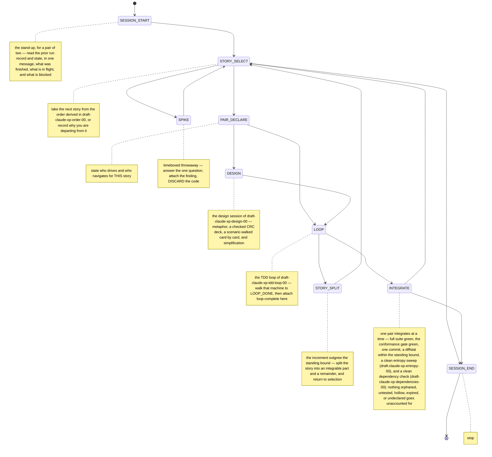

# draft-claude-xp-pairing-00: Extreme Programming for Human–Agent Pairing

**Status:** DRAFT
**Category:** Experimental
**Authors:** Claude (drafting agent), Norman Nunley, Jr <nnunley@gmail.com>
**Date:** 2026-08-19

## Abstract

Extreme Programming's twenty-nine rules assume a co-located team of humans
around shared hardware. This document converts them for a pair of one human
and one software agent — or two agents with a human customer — and specifies
the conversion as an executable session machine rather than a description of
one: stories are not started without acceptance criteria and a declared
standing increment bound, code is not written without a declared pair
composition,
and integration is refused until the whole suite is green and the increment
is small enough to have been reviewed while it was written. The rules whose
substance survives translation are translated here; the rules whose
substance is machinery for a team that does not exist here are rejected on
the record.

## Motivation

An agent asked to "do XP" reproduces the vocabulary and drops the
constraints. It reports test-first while writing tests after; it reports
small increments while emitting four hundred lines between checkpoints; it
reports pairing while nobody looked at the diff. Every one of those failures
is invisible in a transcript and expensive downstream, and none of them is
fixed by restating the practice in a prompt — the agent already knows the
practice and asserted it.

The failure is specific to the pairing case. XP's rules are enforced in a
human team by physics: the navigator sees the keyboard, the pair rotates
because bodies move, the integration machine has one token because it is one
machine. None of that physics exists between a human and an agent. The
navigator sees a streamed diff and only while it stays small enough to
follow; the "pair" may be two agents; the integration machine is CI. Strip
the physics and the rules degrade to slogans an agent can claim without
doing.

This series already has the replacement for the missing physics. Machines
carry stage guidance and guarded edges; the executor refuses to disclose or
enter the next stage until the current stage's evidence is attached; the run
record is a witness auditable against the machine and the repository
(draft-ndn-fsm-session-00, draft-ndn-executable-plans-00). Applying it to XP
turns "code the unit test first" from an instruction the agent may narrate
into a transition the agent cannot take without a failing test in hand.

## Terminology

The key words "MUST", "MUST NOT", "REQUIRED", "SHALL", "SHALL NOT", "SHOULD",
"SHOULD NOT", "RECOMMENDED", "NOT RECOMMENDED", "MAY", and "OPTIONAL" in this
document are to be interpreted as described in BCP 14 (RFC 2119, RFC 8174)
when, and only when, they appear in all capitals, as shown here.

- **pair** — the two parties holding a story: a **driver** who writes and a
  **navigator** who reads, questions, and signs off. Either role MAY be held
  by a human or by an agent.
- **pair composition** — which party holds which role for one story, one of
  `human-navigator` (agent drives, human navigates in stream),
  `agent-navigator` (agent drives, a fresh-context agent navigates), or
  `customer-only` (agent drives, human supplies acceptance and go/no-go and
  does not read the diff as it is written).
- **increment bound** — a STANDING ceiling on any single integrable change,
  in files and lines. One constant for the system, not a per-story number:
  it is the reviewability budget, and an increment larger than the navigator
  can follow while it is written was not paired, whatever the transcript
  says. A story that does not fit is split; the bound does not move.
- **session** — one contiguous working period, opened by a briefing and
  closed by a recorded velocity. The unit the session machine walks.
- **story** — a unit of customer-visible behavior with an acceptance
  criterion, identified by a stable ID.
- **spike** — a timeboxed throwaway investigation answering one question.
  Its code is discarded, never integrated.
- **run record** — the session's persisted path and evidence, per
  draft-ndn-fsm-session-00; the ledger this document's guards write into.

## Specification

### The session is a machine, not a habit

An XP session under this document MUST be walked with the fsm executor over
a run record: the agent MUST derive the current stage's guidance and its
legal moves from the machine rather than from memory, and MUST NOT act on a
stage it has not entered. [R-xp-session]

```fsm @R-xp-session
initial SESSION_START
SESSION_START -> STORY_SELECT
STORY_SELECT -> PAIR_DECLARE
STORY_SELECT -> SPIKE
STORY_SELECT -> SESSION_END
SPIKE -> STORY_SELECT
PAIR_DECLARE -> LOOP
PAIR_DECLARE -> DESIGN
DESIGN -> LOOP
LOOP -> INTEGRATE
LOOP -> STORY_SPLIT
STORY_SPLIT -> STORY_SELECT
INTEGRATE -> STORY_SELECT
INTEGRATE -> SESSION_END
terminal SESSION_END
guard SESSION_START -> STORY_SELECT: briefing bound groom
guard STORY_SELECT -> PAIR_DECLARE: story acceptance order
guard STORY_SELECT -> SPIKE: question timebox
guard SPIKE -> STORY_SELECT: finding discarded
guard PAIR_DECLARE -> LOOP: mode
guard PAIR_DECLARE -> DESIGN: mode
guard DESIGN -> LOOP: deck
guard LOOP -> INTEGRATE: loop-complete
guard LOOP -> STORY_SPLIT: overrun
guard STORY_SPLIT -> STORY_SELECT: split
guard INTEGRATE -> STORY_SELECT: suite commit diffstat sweep deps
guard INTEGRATE -> SESSION_END: suite commit diffstat sweep deps
note SESSION_START: the stand-up, for a pair of two — read the prior run record and state, in one message, what was finished, what is in flight, and what is blocked; attach it as briefing, attach the system's standing increment bound unchanged, and attach the grooming report of draft-claude-xp-grooming-00 — what drifted, what is unserved, what has aged
note STORY_SELECT: take the next story from the order derived in draft-claude-xp-order-00, or record why you are departing from it; nothing may be written until the story has an ID and an acceptance criterion in the customer's words; its size is not estimated, because the standing bound already answers that question
note PAIR_DECLARE: state who drives and who navigates for THIS story; in agent-navigator mode dispatch the navigator with fresh context, never the drafting session
note SPIKE: timeboxed throwaway — answer the one question, attach the finding, DISCARD the code; a spike that survives to integration was not a spike
note DESIGN: the design session of draft-claude-xp-design-00 — metaphor, a checked CRC deck, a scenario walked card by card, and simplification; walk that machine to DESIGN_DONE, then attach deck here
note LOOP: the TDD loop of draft-claude-xp-tdd-loop-00 — walk that machine to LOOP_DONE, then attach loop-complete here
note STORY_SPLIT: the increment outgrew the standing bound — split the story into an integrable part and a remainder, and return to selection; the bound never moves to fit work already done
note INTEGRATE: one pair integrates at a time — full suite green, the conformance gate green, one commit, a diffstat within the standing bound, a clean entropy sweep (draft-claude-xp-entropy-00), and a clean dependency check (draft-claude-xp-dependencies-00): nothing orphaned, untested, hollow, expired, or undeclared goes unaccounted for
note SESSION_END: stop; the run record already says what was done, so nothing further is required to close
```



### A story is not started without its contract

The executor MUST refuse to enter `PAIR_DECLARE` until `story:` and
`acceptance:` are attached to `STORY_SELECT`, and MUST refuse
to enter `LOOP` until `mode:` is attached to `PAIR_DECLARE`. The acceptance
criterion MUST be recorded in the customer's words, not the agent's
restatement of them, so that the record shows what was asked rather than
what was understood. [R-xp-story-gate]

```xp-run @R-xp-story-gate
machine initial SESSION_START
machine SESSION_START -> STORY_SELECT
machine STORY_SELECT -> PAIR_DECLARE
machine PAIR_DECLARE -> LOOP
machine LOOP -> DONE
machine terminal DONE
machine guard SESSION_START -> STORY_SELECT: briefing bound groom
machine guard STORY_SELECT -> PAIR_DECLARE: story acceptance order
machine guard PAIR_DECLARE -> LOOP: mode
refuse STORY_SELECT missing briefing bound groom
attach briefing: nothing in flight, corpus green
bound 3 files 150 lines
attach groom: no drift, no unserved targets
advance STORY_SELECT
refuse PAIR_DECLARE missing story acceptance order
story XP-1
accept the gate refuses a story with no acceptance criterion
attach order: XP-1 XP-2 — XP-1 forced by the deck
advance PAIR_DECLARE why: story contract complete
at PAIR_DECLARE
refuse LOOP missing mode
pair human-navigator
advance LOOP
at LOOP
```

The `order:` attachment records which derivation the selection followed,
per draft-claude-xp-order-00; a story set with no deck records `order: no
deck`, which is the honest value early in a system's life.

### Size is bounded, never estimated

The bound is a standing property of the system, attached unchanged at
`SESSION_START`, and it MUST NOT vary per story. Per-story size estimates
are forbidden: they converge on a single value in practice, so the estimate
carries no information the constant does not already carry, and producing
one per story dresses a ritual as a measurement. The only sizing question
with an answer is binary — does the work fit the bound — and the only
response to "no" is to split the story. [R-xp-no-estimates]

Continuous navigation is only possible over changes the navigator can read
while they are written, so the bound is enforced at integration: the
executor MUST refuse `INTEGRATE -> STORY_SELECT` and `INTEGRATE ->
SESSION_END` until `diffstat:` is attached, and a diffstat exceeding the
standing bound MUST route the run through `STORY_SPLIT` rather than through
integration. The bound MUST NOT be raised to accommodate work already
written; raising it after the fact converts the reviewability budget into a
rubber stamp. A system MAY set its constant once, deliberately, as a
property of what its navigator can read — never as a response to a story in
flight. [R-xp-increment]

```xp-run @R-xp-increment
machine initial LOOP
machine LOOP -> INTEGRATE
machine LOOP -> STORY_SPLIT
machine STORY_SPLIT -> DONE
machine INTEGRATE -> DONE
machine terminal DONE
machine guard LOOP -> INTEGRATE: loop-complete
machine guard LOOP -> STORY_SPLIT: overrun
machine guard STORY_SPLIT -> DONE: split
refuse STORY_SPLIT missing overrun
attach overrun: diffstat 7 files 410 lines exceeds the standing bound 3 files 150 lines
advance STORY_SPLIT why: increment outgrew its reviewability budget
at STORY_SPLIT
refuse DONE missing split
attach split: XP-1a integrable now, XP-1b remainder
advance DONE
audit ok
```

```xp-run @R-xp-no-estimates
machine initial SESSION_START
machine SESSION_START -> STORY_SELECT
machine STORY_SELECT -> DONE
machine terminal DONE
machine guard SESSION_START -> STORY_SELECT: briefing bound groom
machine guard STORY_SELECT -> DONE: story acceptance
refuse STORY_SELECT missing briefing bound groom
attach briefing: standing bound unchanged from last session
bound 3 files 150 lines
attach groom: no targets
advance STORY_SELECT
refuse DONE missing story acceptance
story XP-2
accept the story gate asks for no size
advance DONE why: size is not a story-level question
at DONE
audit ok
```

### Integration is refused until everything is green

An agent MUST NOT integrate on the strength of the tests it just wrote. The
executor MUST refuse either edge out of `INTEGRATE` until `suite:`,
`commit:`, and `diffstat:` are attached, where `suite:` records a run of the
whole test suite and, in a repository carrying an RFC series, the whole
conformance gate — the property being preserved is that work on one story
cannot silently regress another's, which is the same property the corpus
rule already asserts for RFCs. Session close requires nothing further: the
run record already holds what was done. [R-xp-integrate-green]

```xp-run @R-xp-integrate-green
machine initial INTEGRATE
machine INTEGRATE -> SESSION_END
machine terminal SESSION_END
machine guard INTEGRATE -> SESSION_END: suite commit diffstat sweep deps
refuse SESSION_END missing suite commit diffstat sweep deps
suite 41 passed, 0 failed, gate green
diffstat 2 files 74 lines
attach sweep: clean — nothing orphaned or expired
attach deps: clean — every import declared, every declaration resolved
work implement XP-1 against its acceptance criterion
advance SESSION_END why: story integrated, suite and gate green
at SESSION_END
audit ok
```

### The rules, and where each one went

Every rule at extremeprogramming.org/rules.html has exactly one disposition:
**here** (translated by this document), **delegated** (translated by a named
child document), or **rejected** (its substance does not survive translation
to a two-party pair, with the reason on the record). Every delegation points
to a document that exists; this document names no successor it has not
written, because a delegation to an unwritten document is an IOU, not a
disposition.

| XP rule | Disposition | Translation |
|---|---|---|
| User stories | **here** | The story contract guarded at `STORY_SELECT`: an ID and an acceptance criterion in the customer's words. No estimate — a card's worth, and nothing about size. Their *order* is derived from the deck, not negotiated (draft-claude-xp-order-00) |
| Release planning | rejected | It negotiates scope against a date with a customer who is elsewhere. Here the customer is in the room and answers at `STORY_SELECT`; a negotiation ceremony for a conversation that already happens is pure overhead |
| Make frequent small releases | **here** | Every story integrates green under the standing bound. "Small" is the bound and "frequent" is per story — both mechanical, neither planned nor estimated |
| Project divided into iterations | **here** | The session is the iteration: opened by a briefing, closed when the pair stops. No separate cadence is imposed on top of it |
| Iteration planning | rejected | Its content is choosing the next story, which is `STORY_SELECT` — and the sequencing part of it is computed from the design graph rather than discussed. Naming that a meeting adds a stage to the machine and nothing to the work |
| Dedicated open work space | **here** | The streamed transcript is the workspace; the shared space is visibility of the diff as it is written, which is why the standing bound is a guard |
| Set a sustainable pace | **here** | Bounded increments and an interrupt point between every leg of the loop; sustainability for a pair whose agent does not tire means the human's review capacity, which is what the bound rations |
| Stand up meeting each day | **here** | `SESSION_START` briefing derived from the prior run record: finished, in flight, blocked |
| Project velocity is measured | rejected | Velocity exists to forecast a team's capacity across iterations. A pair has no capacity to forecast and no one to forecast it for; the run record already says what was done, and a number derived from it would be read by nobody |
| Move people around | **here** | Rotate fresh-context navigators. A fresh agent brings the un-anchored reading that rotation exists to buy, and it is the only form of rotation available to a two-party pair |
| Fix XP when it breaks | **here** | Register the friction against this document per draft-ndn-feedback-registration-00; the remedy is a superseding draft, not silent drift |
| Simplicity | delegated → xp-design | — |
| Choose a system metaphor | delegated → xp-design | — |
| CRC cards for design sessions | delegated → xp-design | — |
| Spike solutions to reduce risk | **here** | The `SPIKE` branch: one question, a timebox, a recorded finding, and discarded code |
| No functionality added early | **here** | The acceptance criterion bounds the story and the increment bound bounds the diff; anything beyond both is scope the customer did not ask for |
| Refactor whenever and wherever | delegated → xp-tdd-loop | The REFACTOR leg of the loop machine |
| Customer is always available | **here** | The human holds the customer role in every composition, including `customer-only`; a blocked question halts the story rather than being resolved by assumption |
| Code written to agreed standards | **here** | Standards are the repository's existing conventions, read from the code rather than assumed; disagreements are settled before `LOOP`, not in review |
| Code the unit test first | delegated → xp-tdd-loop | The guard on RED → GREEN |
| All production code is pair programmed | **here** | Pair composition declared per story at `PAIR_DECLARE`; navigator sign-off guards loop completion in the child machine |
| Only one pair integrates at a time | **here** | One `INTEGRATE` state, one commit, and a run record that cannot record two concurrent integrations of the same session |
| Integrate often | **here** | Integration is per story, bounded by the increment budget — the bound makes "often" mechanical rather than aspirational |
| Dedicated integration computer | rejected | Its substance is exclusive access to a known-good environment; CI plus the conformance gate provide that, and a dedicated machine adds nothing to a pair with no queue |
| Collective ownership | **here** | Any file may be edited by either party; the constraint that makes this safe is not ownership but the whole-suite guard at `INTEGRATE` |
| All code must have unit tests | delegated → xp-tdd-loop | — |
| All code passes all unit tests before release | **here** | The `suite:` guard on both edges out of `INTEGRATE` |
| When a bug is found, tests are created | delegated → xp-tdd-loop | A bug enters the loop as a story whose RED test is the reproduction |
| Acceptance tests run often, score published | **here** | The acceptance criterion is attached at selection and re-attached at loop completion; the score is the run record, which is auditable rather than reported |

### Relation to the series

This document is the pairing-scale sibling of draft-ndn-executable-plans-00:
a plan run walks an implementation of a specification, an XP session walks a
day of building one, and both use the same three verbs over the same two
files. Where they meet, the plan is authoritative for what to build and this
document for how a session builds it. Neither substitutes for the
conformance gate of draft-ndn-conformance-execution-00; the `suite:` guard
requires that gate to have been run, not to have been replaced.

## Formal Grammar

The evidence keys this document's guards name have fixed value syntax, so
that a run record is machine-readable rather than merely suggestive:

```abnf
mode-value      = %s"human-navigator" / %s"agent-navigator" / %s"customer-only"
bound-value     = file-count SP %s"files" SP line-count SP %s"lines"
diffstat-value  = file-count SP %s"files" SP line-count SP %s"lines"
file-count      = 1*2DIGIT
line-count      = 1*5DIGIT
```

## Alternatives Considered

### XP as an Informational candidate practice

The path every prior external methodology took into this series
(draft-claude-vibe-guardrails-00 and its siblings): describe the practice,
sketch an fsm, add no requirement IDs, gate nothing. Rejected for XP because
XP's rules are precisely the ones an agent will claim without performing —
test-first, small increments, pairing — and a document that only describes
them reproduces the failure it was written to fix. The conversion is worth
doing only if the guards bite.

### One RFC covering all twenty-nine rules

A single document translating the whole methodology. Rejected: the planning
game, the design practices, and the TDD loop each carry enough machinery to
need their own machines and their own evidence, and writing all of them
before executing any would specify efforts not yet run — against this
series' evidence-first grain. The recursive cut keeps each document at the
size of one machine.

### Children mirroring XP's own five categories

Planning / Managing / Designing / Coding / Testing, as the source
organizes them. Rejected because the categories cut across the machinery:
"code the unit test first" is Coding and "all code must have unit tests" is
Testing, but they are one guard on one edge of one machine. The cut here is
by machine, not by taxonomy.

### A planning-game child document

An `xp-planning-game` document covering user stories, release planning,
iterations, iteration planning, and velocity — the shape the source's
Planning and Managing categories suggest. Rejected as ceremony that a pair
cannot use. Every one of those practices coordinates parties who are not in
the same conversation: a release plan negotiates with a customer who must be
scheduled, an iteration boundary synchronizes people working in parallel,
and velocity forecasts a capacity someone else is planning against. In a
pair whose customer is present and answering, all five collapse into one
question asked at `STORY_SELECT` — what next, and how will we know it is
done — which the story contract already guards.

The rejection is on applicability, not on provenance. The Planning Game is
one of the original twelve practices and the Portland Pattern Repository
documents it alongside user stories, iteration planning, and project
velocity; nothing here claims it was bolted on later. What is claimed is
narrower and sufficient: those practices coordinate parties, a pair has no
parties to coordinate, and a practice whose purpose is absent is ceremony
however venerable it is. A team adopting this document's descendants at team
scale SHOULD restore them, and this rejection does not travel with them.

### Per-story size estimates

Estimating each story — in points, hours, or a per-story bound — and
planning against the estimate. Rejected on evidence rather than on taste:
estimates converge on a single size across a backlog, so the number
distinguishes almost nothing, and its only reliable signal is that a story
too large to estimate confidently should be split. A standing bound delivers
that signal directly, with no number to negotiate, inflate, or track. This
is also why velocity is rejected above — a velocity computed from
converging estimates is a story count wearing a unit.

### Advisory tracking without refusal

Record position and evidence, never block. Rejected as the status quo in
different clothing: an agent that can advance without evidence will, and the
record then documents the claim rather than the work.

### Bound enforced by review rather than by guard

Ask the navigator to object when an increment gets too large. Rejected
because it puts the burden on the party with the least information at the
worst moment — by the time an over-large diff is visible it has been
written, and the cost of rejecting it is what makes it get accepted.

## Security Considerations

The executor is process governance, not an authorization boundary. An agent
with write access to the run record can attach a `suite:` line naming a test
run that never happened, or edit the path directly. `--audit` narrows this
to claims that point at artifacts: `commit:` and `anchor:` values must
resolve in the repository and anchors must be in ancestry order, so a forged
integration requires a real commit. It does not close the gap for prose
evidence, and it is not meant to — the audit reduces forgery to "artifacts a
reviewer would reject," and human review remains the last gate.

Two hazards are specific to this document. First, `agent-navigator` mode
delegates review to an agent; a navigator dispatched from the drafting
session inherits its assumptions and its blind spots, which is why the
machine's guidance requires fresh context — a navigator that already
believes the code is right is a rubber stamp with a transcript. Second, the
increment bound governs how much unreviewed change reaches integration, so
a bound raised mid-story silently widens the trust boundary; the
specification forbids raising it after the fact, and a run record showing a
bound revised between selection and integration SHOULD be treated as an
unreviewed change.

Stories touching authentication, permissions, input handling, or secrets
carry review requirements this document does not weaken: `customer-only`
mode is NOT RECOMMENDED for them, since it removes the only human reading of
the diff.

## Compatibility

Nothing in this document changes existing tooling: the session machine,
guards, run records, and audit are the existing fsm executor's features, and
the `xp-run` evidence type is a new adapter plus vocabulary alongside the
existing ones. Repositories not using this document are unaffected; a
repository adopting it gains one new evidence type in its corpus.

Sessions begun before adoption have no run record; a first session under
this document starts at `SESSION_START` with a briefing assembled by hand
rather than derived from a prior record.

## References

- Extreme Programming rules: http://www.extremeprogramming.org/rules.html
  (Don Wells), the twenty-nine rules this document converts.
- Portland Pattern Repository, http://c2.com/xp/ — the practice-linked
  presentation of XP against which this document's lighter readings of
  planning and velocity were checked.
- draft-claude-xp-tdd-loop-00 — the delegated red/green/refactor machine.
- draft-claude-xp-order-00 — the derivation behind the `order:` attachment
  at `STORY_SELECT`.
- draft-claude-xp-grooming-00 — targets, drift, and aging; the derivation
  behind the `groom:` attachment at `SESSION_START`.
- draft-claude-xp-entropy-00 — the entropy sweep behind the `sweep:`
  attachment at `INTEGRATE`: the one guard that forces removal.
- draft-claude-xp-dependencies-00 — the dependency check behind the
  `deps:` attachment at `INTEGRATE`.
- draft-claude-xp-slop-00 — textual slop signatures, advisory, resolved in
  the loop's REFACTOR leg.
- draft-ndn-fsm-session-00 — run records, guards, evidence attachment,
  anchoring, and `--audit`.
- draft-ndn-executable-plans-00 — the three-verb encapsulation this
  document reuses at session scale.
- draft-ndn-conformance-execution-00 — the gate the `suite:` guard requires.
- draft-ndn-feedback-registration-00 — where "fix XP when it breaks" routes.
- draft-ndn-authoring-rfcs-00 — the process BCP, fsm vocabulary, and the
  corpus rule the integration guard mirrors.
- RFC 2119, RFC 8174 (BCP 14) — requirement language.

## Changelog

- 2026-08-19: DRAFT created. Converts the twenty-nine XP rules for a pair of
  one human and one agent (or two agents with a human customer), as an
  executable session machine with hard guards on story contract, pair
  composition, increment bound, and whole-suite integration. Rule
  dispositions recorded in full: eighteen translated here, seven delegated
  to child documents, four rejected. Per-story pair composition and
  fresh-context agent navigators follow from the author's requirement that
  the co-driver is sometimes another agent and that feedback is continuous
  over a visible stream.
- 2026-08-20: `deps` added to both INTEGRATE guards, consuming
  draft-claude-xp-dependencies-00 — a hallucinated package is the one form
  of accretion that is directly exploitable.
- 2026-08-20: `sweep` added to both INTEGRATE guards, consuming
  draft-claude-xp-entropy-00. Until now every guard in this document
  constrained what entered the codebase and none forced anything out, so a
  project could satisfy all of them and still grow without bound; the
  sweep is the missing direction.
- 2026-08-20: `groom` added to the SESSION_START guard, consuming
  draft-claude-xp-grooming-00 — a session cannot open without the pair
  having seen what drifted from current targets, what target nothing
  serves, and what has aged.
- 2026-08-20: the increment bound became a STANDING system constant
  attached at SESSION_START instead of a per-story declaration, and
  per-story size estimates are now forbidden outright. Rationale from the
  author: sizing estimates converge on the same size for everything, so the
  only information they carry is that an oversized story should be split —
  which the standing bound signals directly. `bound` left the STORY_SELECT
  guard for the SESSION_START guard.
- 2026-08-19: `order` added to the STORY_SELECT guard, consuming the
  derivation of draft-claude-xp-order-00 — the ordering question the
  rejected planning ceremony used to answer is now computed from the deck.
- 2026-08-19: planning-game delegation dropped and the velocity guard
  removed, after the author's objection to planning ceremony. User stories,
  frequent small releases, and iterations are now translated here (the story
  contract, the increment bound, and the session respectively); release
  planning, iteration planning, and velocity measurement are rejected as
  coordination machinery for parties a pair does not have. Every remaining
  delegation now points to a written document.
- 2026-08-19: DESIGN stage added between PAIR_DECLARE and LOOP, delegating
  to draft-claude-xp-design-00 and guarded on a checked CRC deck. The stage
  is optional per story (PAIR_DECLARE -> LOOP remains legal) and sits after
  pair declaration so the navigator designs rather than reviews.
