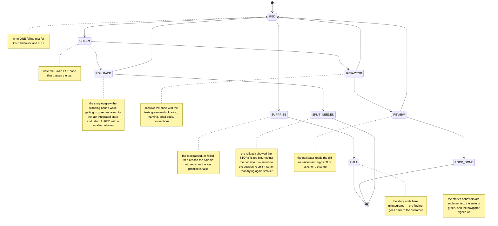

# draft-claude-xp-tdd-loop-00: The Paired Test-First Loop

**Status:** DRAFT
**Category:** Experimental
**Authors:** Claude (drafting agent), Norman Nunley, Jr <nnunley@gmail.com>
**Date:** 2026-08-19

## Abstract

This document specifies the red/green/refactor loop delegated from
draft-claude-xp-pairing-00's `LOOP` stage, as a machine whose edges are
guarded by the artifacts the legs produce: the implementation stage cannot
be entered without a test observed failing, the refactor stage cannot be
entered without that test observed passing within the story's increment
standing bound, and the loop cannot complete without the navigator's
sign-off. A test
that fails for the wrong reason and a test that passes before any code was
written both route to a halt rather than forward, because both mean the
loop's premise is false.

## Motivation

"Code the unit test first" is the XP rule an agent is least able to prove and
most likely to assert. Writing the test after the implementation and running
both together produces a transcript indistinguishable from test-first work:
the test exists, it passes, the summary says RED then GREEN. The distinction
that matters — that someone watched the test fail for the expected reason
before any implementation existed — leaves no trace unless it is captured
when it happens.

It is also the rule with the most informative failure modes, and prose
process documents throw them away. A test that passes on first run means the
behavior already exists or the test does not test what its author thinks. A
test that fails in an unexpected way means the codebase is not in the state
the pair believes it is in. Both are discoveries; both are routinely
narrated as "adjusted the test" and lost. In a machine they are states with
their own exits, so the discovery is recorded and the pair stops rather than
edits until green.

The parent document supplies the story contract, the standing increment
bound, and the pair composition. This document spends them.

## Terminology

The key words "MUST", "MUST NOT", "REQUIRED", "SHALL", "SHALL NOT", "SHOULD",
"SHOULD NOT", "RECOMMENDED", "NOT RECOMMENDED", "MAY", and "OPTIONAL" in this
document are to be interpreted as described in BCP 14 (RFC 2119, RFC 8174)
when, and only when, they appear in all capitals, as shown here.

- **leg** — one stage of the loop: RED, GREEN, REFACTOR, or REVIEW.
- **expected failure** — a test failure whose message matches the behavior
  the test was written to demand: the asserted value is absent, wrong, or
  unimplemented. Any other failure — import error, harness misconfiguration,
  unrelated exception — is an **unexpected failure**.
- **navigator sign-off** — the navigator's explicit statement that the diff
  as written is acceptable, recorded as `navigator-ok:` with the navigator's
  identity and what was read.
- **behavior** — one testable assertion of the story's acceptance criterion.
  A story with several behaviors walks the loop once per behavior.
- **overrun** — the accumulated diff for the current story exceeding the
  standing increment bound the parent document attaches at session start.
  The bound is a constant; stories are split to fit it, never sized against
  it in advance.

## Specification

### The loop is a machine

A story's implementation MUST walk this machine from `RED` to a terminal
state, and the parent session MUST NOT attach `loop-complete` until it
reaches `LOOP_DONE`. Reaching `HALT` ends the story unintegrated: the pair
returns to the customer with what it found. [R-xp-loop]

```fsm @R-xp-loop
initial RED
RED -> GREEN
RED -> SURPRISE
SURPRISE -> HALT
GREEN -> REFACTOR
GREEN -> ROLLBACK
ROLLBACK -> RED
ROLLBACK -> SPLIT_NEEDED
REFACTOR -> RED
REFACTOR -> REVIEW
REVIEW -> RED
REVIEW -> LOOP_DONE
terminal LOOP_DONE HALT SPLIT_NEEDED
guard RED -> GREEN: red-test
guard RED -> SURPRISE: observed
guard SURPRISE -> HALT: report
guard GREEN -> REFACTOR: green-test diffstat
guard GREEN -> ROLLBACK: overrun
guard ROLLBACK -> RED: reverted
guard ROLLBACK -> SPLIT_NEEDED: split
guard REFACTOR -> RED: suite
guard REFACTOR -> REVIEW: suite
guard REVIEW -> RED: navigator-change
guard REVIEW -> LOOP_DONE: navigator-ok acceptance
note RED: write ONE failing test for ONE behavior and run it; attach red-test with the command and the failure message before writing any implementation
note SURPRISE: the test passed, or failed for a reason the pair did not predict — the loop premise is false; investigate, attach the report, and take it to the customer, do NOT edit the test until it fails the way you wanted
note GREEN: write the SIMPLEST code that passes the test; no error handling the test does not demand, no abstractions, no adjacent fixes; attach green-test and the running diffstat
note ROLLBACK: the story outgrew the standing bound while getting to green — revert to the last integrated state and return to RED with a smaller behavior; the bound is not negotiable mid-story
note REFACTOR: improve the code with the tests green — duplication, naming, dead code, conventions; run the WHOLE suite and attach it; if behaviors remain, go back to RED
note REVIEW: the navigator reads the diff as written and signs off or asks for a change; in agent-navigator mode the navigator MUST be dispatched with fresh context
note LOOP_DONE: the story's behaviors are implemented, the suite is green, and the navigator signed off; the parent session may now integrate
note HALT: the story ends here unintegrated — the finding goes back to the customer
note SPLIT_NEEDED: the rollback showed the STORY is too big, not just the behaviour — return to the session to split it rather than trying again smaller
```



### Red before green, with the failure in hand

The executor MUST refuse `RED -> GREEN` until `red-test:` is attached,
recording the test command and the observed failure message. Implementation
code MUST NOT be written before that attachment exists: the attachment is
the evidence that the test was observed failing against a codebase without
the implementation, which is the entire content of "test first" and the only
part of it that leaves a trace. [R-xp-red-first]

```xp-run @R-xp-red-first
machine initial RED
machine RED -> GREEN
machine GREEN -> DONE
machine terminal DONE
machine guard RED -> GREEN: red-test
machine guard GREEN -> DONE: green-test diffstat
refuse GREEN missing red-test
red pytest -k rounds_half_up — AssertionError: expected 2.5, got 2
advance GREEN why: failure is the one the test demands
at GREEN
refuse DONE missing green-test diffstat
green pytest -k rounds_half_up — 1 passed
diffstat 1 files 6 lines
advance DONE
audit ok
```

### A surprise is a discovery, not an obstacle

If the test passes on its first run, or fails in a way the pair did not
predict, the run MUST take `RED -> SURPRISE` and MUST NOT take `RED -> GREEN`.
Editing the test until it fails the intended way is forbidden: it destroys
the evidence that the codebase was not in the believed state. `SURPRISE` MUST
carry `observed:` — what actually happened — and MUST exit only to `HALT`
with a `report:` for the customer. [R-xp-surprise]

```xp-run @R-xp-surprise
machine initial RED
machine RED -> SURPRISE
machine SURPRISE -> HALT
machine terminal HALT
machine guard RED -> SURPRISE: observed
machine guard SURPRISE -> HALT: report
refuse SURPRISE missing observed
attach observed: test passed on first run — rounding already implemented in money.py
advance SURPRISE why: loop premise false
at SURPRISE
refuse HALT missing report
attach report: behavior exists since commit 9f2; story XP-4 is redundant
advance HALT
audit ok
```

### The navigator signs the diff, not the summary

The executor MUST refuse `REVIEW -> LOOP_DONE` until `navigator-ok:` and
`acceptance:` are attached. `navigator-ok:` MUST name the navigator and what
was read; a sign-off recorded against a summary of the change rather than
the change itself does not satisfy this requirement. In `customer-only`
composition the human is the navigator of record and the sign-off is their
go/no-go on the acceptance criterion, which is weaker and is why that mode
is NOT RECOMMENDED for security-relevant stories in the parent document.
[R-xp-navigator-signoff]

```xp-run @R-xp-navigator-signoff
machine initial REFACTOR
machine REFACTOR -> REVIEW
machine REVIEW -> RED
machine REVIEW -> LOOP_DONE
machine RED -> LOOP_DONE
machine terminal LOOP_DONE
machine guard REFACTOR -> REVIEW: suite
machine guard REVIEW -> LOOP_DONE: navigator-ok acceptance
machine guard REVIEW -> RED: navigator-change
attach suite: 41 passed, 0 failed
advance REVIEW
refuse LOOP_DONE missing navigator-ok acceptance
refuse RED missing navigator-change
attach navigator-ok: ndn read the diff in stream, 2 files 74 lines
accept amounts round half up in receipts
advance LOOP_DONE why: signed off on the diff as written
at LOOP_DONE
audit ok
```

### Bugs enter as stories

A defect MUST enter this loop as a story whose RED test is the reproduction:
the failing test is the bug report in executable form, and the loop's own
guard therefore satisfies XP's "when a bug is found, tests are created"
without a separate rule. A fix committed without a reproduction test MUST
NOT be integrated. [R-xp-bug-repro]

```xp-run @R-xp-bug-repro
machine initial RED
machine RED -> GREEN
machine GREEN -> DONE
machine terminal DONE
machine guard RED -> GREEN: red-test
machine guard GREEN -> DONE: green-test
refuse GREEN missing red-test
red pytest -k issue_318_negative_total — AssertionError: expected 0, got -1
advance GREEN why: reproduction observed failing
refuse DONE missing green-test
green pytest -k issue_318_negative_total — 1 passed
advance DONE
audit ok
```

## Formal Grammar

The loop's evidence keys carry the observation, not a claim about it:

```abnf
red-test-value    = command SP "—" SP failure-message
green-test-value  = command SP "—" SP pass-summary
command           = 1*VCHAR *( SP 1*VCHAR )
failure-message   = 1*VCHAR *( SP 1*VCHAR )
pass-summary      = 1*DIGIT SP %s"passed" *( "," SP 1*VCHAR )
navigator-ok      = navigator SP %s"read" SP 1*VCHAR *( SP 1*VCHAR )
navigator         = 1*VCHAR
```

## Alternatives Considered

### Test-first as instruction rather than guard

State the rule in the skill and trust the agent. Rejected: this is the
status quo whose failure motivated the document, and the failure is
undetectable in a transcript.

### Letting the pair edit a surprising test until it fails correctly

The common practice, and the fastest way past a surprise. Rejected because
the surprise is usually the most valuable information the loop produces —
the behavior already exists, or the test targets the wrong thing — and
editing to green discards it silently. The machine spends a terminal state
on making that discovery expensive to lose.

### Batching several behaviors per red

Write the tests for a whole story, then implement. Rejected: it defeats the
increment bound, since the diff between checkpoints becomes the story rather
than the behavior, and a navigator reading in stream has nothing to read
until the end.

### Refactor as an optional leg

Skip REFACTOR when the code looks fine. Rejected as a structural choice —
the leg costs nothing when there is nothing to do, and making it optional
makes it skippable under time pressure, which is exactly when it is
skipped and exactly when it matters.

### A REVIEW state per leg rather than per loop

Sign-off after every green. Rejected as over-checkpointing for a navigator
watching a stream: continuous feedback already covers the legs, and the
sign-off exists to mark the point where the pair commits to the story's
diff as a whole.

## Security Considerations

This document narrows what an agent can integrate without a second party
reading it, which is a security property in the same sense as code review:
the navigator sign-off guard is the only mechanism preventing a change from
reaching `INTEGRATE` unread. Its weaknesses are the weaknesses of review.
A navigator dispatched without fresh context, or one signing off against a
summary rather than a diff, produces a sign-off that satisfies the guard
while providing no reading; the specification requires both fresh context
and reading the diff, and neither is machine-checkable — the audit can prove
the attachment exists, not that eyes moved.

The `red-test:` and `green-test:` attachments are agent-authored text, so an
agent that never ran the tests can write plausible values. The audit anchors
the run to repository history but does not re-execute the tests; a
repository wanting that property SHOULD have CI re-run the suite at
integration, which is what the parent document's `suite:` guard points at.

`SURPRISE` has a security dimension worth stating: a test passing before any
implementation exists sometimes means the behavior is provided by something
unexpected — a shadowed module, a stale build, a dependency injecting the
symbol. Routing that to a halt rather than to green keeps a supply-chain
surprise from being absorbed as a success.

## Compatibility

This document adds no tooling: it uses the fsm executor, the run record, and
the `xp-run` evidence type introduced with draft-claude-xp-pairing-00. It is
reachable only from that document's `LOOP` stage and has no effect on
repositories that do not adopt the parent.

Projects without test infrastructure cannot walk this machine at all, since
`RED` cannot produce a `red-test:` attachment. That is the intended
behavior: the pair sets up a runner first, as its own story.

## References

- draft-claude-xp-pairing-00 — the parent session machine, story contract,
  standing increment bound, and pair composition this loop spends.
- Extreme Programming rules: http://www.extremeprogramming.org/rules.html —
  "code the unit test first", "all code must have unit tests", "when a bug
  is found tests are created", "refactor whenever and wherever possible".
- draft-ndn-fsm-session-00 — guards, evidence attachment, and `--audit`.
- draft-claude-vibe-guardrails-00 — the series' prior red/green/refactor
  treatment, which this document guards rather than describes.
- RFC 2119, RFC 8174 (BCP 14) — requirement language.

## Changelog

- 2026-08-21: SPLIT_NEEDED added as a third terminal. The parent machine
  had an edge to STORY_SPLIT that no terminal of this machine could reach,
  so the outcome "this story is too big" was expressible at session scale
  and unreachable from inside the loop. Found by compiling the two machines
  together; neither document showed it alone.
- 2026-08-19: DRAFT created as the loop delegated from
  draft-claude-xp-pairing-00's LOOP stage. Guards red-before-green on an
  observed failure, green-to-refactor on an observed pass within the
  increment bound, and loop completion on navigator sign-off against the
  diff. Surprising red outcomes route to a terminal halt rather than being
  edited to green, and defects enter as stories whose RED test is the
  reproduction.
